# Gold Futures Investment Decision Support Tool

## Complete Project Documentation

---

## Table of Contents

1. [Project Overview](#1-project-overview)
2. [Problem Statement](#2-problem-statement)
3. [Dataset](#3-dataset)
4. [System Architecture](#4-system-architecture)
5. [Module Deep Dives](#5-module-deep-dives)
6. [Dashboard Walkthrough](#6-dashboard-walkthrough)
7. [Example Cases](#7-example-cases)
8. [Course Mapping](#8-course-mapping)
9. [Setup and Installation](#9-setup-and-installation)
10. [Design Decisions](#10-design-decisions)

---

## 1. Project Overview

This project is a **personalized investment decision support tool** built for retail investors considering gold futures as part of their portfolio. Unlike typical gold price predictors that output a single forecast, this tool takes the investor's unique situation — their current portfolio, risk tolerance, capital, and investment horizon — and produces personalized recommendations backed by optimization, simulation, and formal decision theory.

The tool integrates seven distinct analytical techniques from the University of Waterloo Management Engineering (MGTE) curriculum into a single interactive Streamlit dashboard.

### What Makes This Different

Every existing analysis of this dataset on Kaggle follows the same pattern: exploratory data analysis, then an LSTM or ARIMA model, then a chart of predicted vs. actual prices. This project is fundamentally different in three ways:

1. **Prescriptive, not just predictive.** The tool doesn't just say "gold will go up." It says "given *your* portfolio and *your* risk tolerance, here's what you should do and why."
2. **Multi-disciplinary.** It combines machine learning, constrained optimization, Monte Carlo simulation, decision theory, statistical analysis, and engineering economics into one integrated pipeline.
3. **Interactive.** Users can adjust their inputs and immediately see how recommendations change — making it a true decision support system.

---

## 2. Problem Statement

**User:** A retail investor (individual managing their own portfolio) who holds or is considering holding gold futures alongside equities and cash/bonds.

**Decision:** How much of their portfolio should be allocated to gold futures?

**Constraints:**
- They have a fixed amount of investable capital
- They have a current portfolio allocation they'd need to rebalance from
- They have a specific risk tolerance (how much loss they can stomach)
- They have a specific investment horizon (when they need the money)
- Rebalancing has transaction costs

**What the tool provides:**
- A forecast of gold price movements (and how reliable that forecast is)
- The mathematically optimal portfolio allocation given their constraints
- A simulation of what could happen to their portfolio (including worst-case scenarios)
- A formal decision analysis comparing strategies under uncertainty
- An economic analysis of whether rebalancing is even worth the cost
- A clear, personalized recommendation

---

## 3. Dataset

**Source:** [Gold Price Forecasting Dataset](https://www.kaggle.com/datasets/vishardmehta/gold-price-forecasting-dataset) from Kaggle (Yahoo Finance, ticker GC=F)

**Period:** June 11, 2021 — January 30, 2026 (1,167 trading days)

**Features (17 columns):**

| Column | Description |
|--------|-------------|
| `date` | Trading date |
| `open`, `high`, `low`, `close` | OHLC prices |
| `adj close` | Adjusted closing price |
| `volume` | Trading volume |
| `ma_7`, `ma_30`, `ma_90` | Moving averages (7, 30, 90-day) |
| `daily_return` | Percentage daily price change |
| `volatility_7`, `volatility_30` | Rolling volatility (7, 30-day) |
| `rsi` | Relative Strength Index |
| `macd`, `macd_signal` | MACD and signal line |
| `bb_upper`, `bb_lower` | Bollinger Bands |

**Additional engineered features (added by `data_loader.py`):**
- Log returns
- 21-day rolling Sharpe ratio
- Lagged features (1, 5, 10, 20-day lags of close, returns, volume, volatility)
- Forward returns (5-day and 30-day targets for ML models)
- Bollinger Band position (normalized 0-1)
- MACD histogram

**Train/Validation/Test split:** 70/15/15 chronologically (no shuffling — this is time series data).

---

## 4. System Architecture

### Project Structure

```
Gold-Futures-Project/
├── app.py                           # Streamlit dashboard (entry point)
├── requirements.txt                 # Python dependencies
├── generate_screenshots.py          # Screenshot generation for docs
├── data/
│   └── gold_price_forecasting_dataset.csv
├── src/
│   ├── __init__.py
│   ├── data_loader.py               # Data loading, cleaning, feature engineering
│   ├── user_profile.py              # User input validation and risk mapping
│   ├── forecasting.py               # ML forecasting (XGBoost, RF, GARCH)
│   ├── risk_analysis.py             # Statistical analysis and VaR
│   ├── portfolio_optimizer.py       # Markowitz mean-variance optimization
│   ├── simulation.py                # Regime-switching Monte Carlo
│   ├── economics.py                 # NPV and break-even analysis
│   └── decision_engine.py           # Multi-criteria decision analysis
└── docs/
    ├── PROJECT_DOCUMENTATION.md     # This file
    └── images/                      # Generated screenshots
```

### Data Flow

```
gold_price_forecasting_dataset.csv
            |
      data_loader.py          (load, clean, engineer features, split)
       /      |       \
      /       |        \
forecasting  risk_analysis  economics
   |              |            |
   v              v            |
portfolio_optimizer  <----  user_profile.py
        |
        v
   simulation.py
        |
        v
  decision_engine.py  <----  economics
        |
        v
     app.py  (Streamlit dashboard)
```

**Key design principle:** Modules that don't depend on user input (forecasting, risk analysis) are computed once and cached. Modules that depend on user input (optimization, simulation, decision analysis) rerun when inputs change, but are computationally lightweight (~1-2 seconds).

---

## 5. Module Deep Dives

### 5.1 Data Loader (`data_loader.py`)

Handles all data preparation:

- **Cleaning:** Rounds Yahoo Finance float32 artifacts (e.g., `1877.4000244140625` becomes `1877.40`), drops rows with missing close prices, sorts by date.
- **Feature engineering:** Adds 20+ derived features including log returns, rolling Sharpe ratio, lagged features at 4 time horizons, Bollinger Band position, MACD histogram, and forward return targets.
- **Splitting:** Chronological 70/15/15 split. Critical: no shuffling, because this is time series data. Shuffling would leak future information into the training set.

### 5.2 User Profile (`user_profile.py`)

A Pydantic model that validates user inputs and maps risk tolerance to concrete parameters:

| Risk Level | Max Gold | Min Cash | Hurwicz Alpha | Target Return Percentile |
|------------|----------|----------|---------------|-------------------------|
| Conservative | 30% | 20% | 0.3 | 25th |
| Moderate | 50% | 10% | 0.5 | 50th |
| Aggressive | 70% | 5% | 0.7 | 75th |

These parameters flow into the optimizer (as constraints), the simulation (as allocation weights), and the decision engine (as the Hurwicz alpha).

### 5.3 Forecasting (`forecasting.py`) — MSCI 446

**Models:**
- **XGBoost Regressor:** Primary model. 200 trees, max depth 5, learning rate 0.05. Predicts 5-day and 30-day forward returns.
- **Random Forest Regressor:** Baseline comparator. 200 trees, max depth 8.
- **GARCH(1,1):** Volatility forecasting via the `arch` library. Captures volatility clustering (confirmed by Ljung-Box test).

**Validation approach:** Walk-forward (expanding window). The model trains on all data up to point T, predicts T+1, then expands the window and repeats. This is the correct approach for time series — k-fold cross-validation would leak future data.

**Why XGBoost, not LSTM?** The dataset has 1,167 rows. LSTMs need thousands to tens of thousands of samples to learn meaningful temporal patterns. XGBoost handles tabular features with small datasets effectively. Choosing XGBoost over LSTM demonstrates ML judgment, not a limitation.

**SHAP explainability:** After training, SHAP (SHapley Additive exPlanations) values are computed to show which features drive predictions. This makes the model interpretable — critical for a decision support tool where users need to trust the output.

### 5.4 Risk Analysis (`risk_analysis.py`) — MSCI 251/253

**Distribution fitting:** Tests three distributions against the actual daily returns:
- Normal (Gaussian)
- Student-t (heavier tails)
- Skew-Normal (asymmetric)

Uses Kolmogorov-Smirnov and Anderson-Darling goodness-of-fit tests. **Student-t consistently wins** — gold returns have fatter tails than a normal distribution, meaning extreme moves are more likely than a Gaussian model would predict.

**Value at Risk (VaR):**
- Historical VaR: Simply the 5th and 1st percentile of actual returns
- Parametric VaR: Assumes normal distribution (compare to historical to see how normality assumption fails)

**Conditional VaR (CVaR / Expected Shortfall):** The average loss in the worst 5% or 1% of days. More informative than VaR because it tells you *how bad* the bad days are, not just the threshold.

**Hypothesis test:** One-sample t-test for whether mean daily return is significantly different from zero. This determines whether gold has a statistically detectable drift (trend) or whether observed returns could be due to chance.

**Volatility clustering test:** Ljung-Box test on squared returns. A significant result (p < 0.05) means large-magnitude days tend to cluster together — justifying the use of GARCH for volatility modeling.

### 5.5 Portfolio Optimizer (`portfolio_optimizer.py`) — MSCI 331/332

**Method:** Markowitz mean-variance optimization using `scipy.optimize.minimize` with the SLSQP (Sequential Least Squares Quadratic Programming) solver.

**Three asset classes:**
- Gold futures (parameters from dataset)
- Equities (S&P 500 proxy: 10% annual return, 18% annual volatility)
- Cash/Bonds (4.5% annual return, ~0% volatility)

**Correlation matrix:** Gold-equity correlation set to 0.05 (near zero — this is gold's key diversification benefit). Gold-cash and equity-cash correlations set to 0.

**Constraints (depend on risk profile):**
- Weights must sum to 1 (equality constraint)
- Each weight between 0 and its maximum (bound constraints)
- Minimum cash holding (inequality constraint)

**Objective:** Maximize the Sharpe ratio (return per unit of risk) subject to constraints.

**Efficient frontier:** The optimizer solves for 50 different target return levels, tracing out the curve of optimal portfolios. The user's current portfolio is plotted on this chart so they can visually see how far they are from the frontier.

### 5.6 Simulation (`simulation.py`) — MSCI 333

**Model:** Regime-switching Geometric Brownian Motion (GBM).

Unlike a simple GBM that uses one mean and one volatility for all periods, this model identifies two regimes:
- **Bull regime:** Higher mean return, lower volatility
- **Bear regime:** Lower (often negative) mean return, higher volatility

The simulation estimates transition probabilities between regimes from historical data, then simulates 10,000 paths where the regime can switch on any given day.

**Why regime-switching?** Gold markets clearly exhibit different behaviors in trending vs. declining periods. A single-distribution simulation would underestimate tail risk by averaging out the regime differences.

**Outputs:**
- 10,000 simulated portfolio value paths over the investment horizon
- Terminal value distribution (where the portfolio ends up)
- Maximum drawdown distribution (worst peak-to-trough decline during the period)
- VaR and CVaR computed from the simulated distribution
- Probability of loss (% of simulations ending below initial capital)

### 5.7 Economics (`economics.py`) — MSCI 261/263

Answers the practical question: **"Is it actually worth rebalancing?"**

- **Transaction costs:** Models a 0.05% bid-ask spread for gold futures trades
- **NPV of rebalancing:** Expected incremental return from the new allocation minus transaction costs, discounted at the risk-free rate. If NPV > 0, rebalancing creates value.
- **Break-even analysis:** How many days until the cumulative benefit of the new allocation exceeds the one-time transaction cost. If break-even > investment horizon, don't rebalance.
- **Opportunity cost:** How much you forgo by *not* rebalancing — the flip side of the transaction cost analysis.

### 5.8 Decision Engine (`decision_engine.py`) — MSCI 452

**Decision matrix structure:**

|  | Bull Scenario | Bear Scenario | Sideways Scenario |
|--|--------------|--------------|-------------------|
| Keep Current | payoff | payoff | payoff |
| Conservative | payoff | payoff | payoff |
| Moderate | payoff | payoff | payoff |
| Aggressive | payoff | payoff | payoff |

Each payoff is the expected portfolio return for that (strategy, scenario) pair, computed by running 2,000 focused simulations with scenario-specific parameters.

**Four decision criteria applied:**

1. **Expected Value:** Multiplies each payoff by its scenario probability and sums. The "rational" default — picks the strategy with the highest probability-weighted average return.

2. **Maximin:** For each strategy, finds the worst-case scenario payoff, then picks the strategy whose worst case is least bad. Favored by extremely risk-averse investors.

3. **Minimax Regret (Savage criterion):** Computes the "regret" for each cell (how much worse it is than the best strategy for that scenario), then picks the strategy whose maximum regret is smallest. For investors who hate the feeling of "I should have done X instead."

4. **Hurwicz criterion:** A weighted average of the best and worst payoffs for each strategy, where the weight (alpha) comes from the user's risk tolerance. Conservative investors weight the worst case more heavily; aggressive investors weight the best case.

**Sensitivity analysis:** Shows which strategy wins under each criterion. When all four agree, the recommendation is robust. When they disagree, the tool surfaces this tension explicitly — the user can decide which decision philosophy matches their personality.

---

## 6. Dashboard Walkthrough

The dashboard is built with Streamlit and consists of a sidebar for inputs and seven tabs for analysis.

### Sidebar

The left sidebar captures all user-specific inputs:
- **Total Investable Capital:** Dollar amount (minimum $1,000)
- **Current Allocation:** Three sliders for Gold %, Equity %, and auto-calculated Cash %
- **Risk Tolerance:** Conservative, Moderate, or Aggressive (radio buttons)
- **Investment Horizon:** 30, 90, 180, or 365 days (dropdown)
- **"Run Analysis" button:** Triggers the full analysis pipeline

### Tab 1: Market Overview

Provides context about the current state of the gold market, independent of the user's inputs.

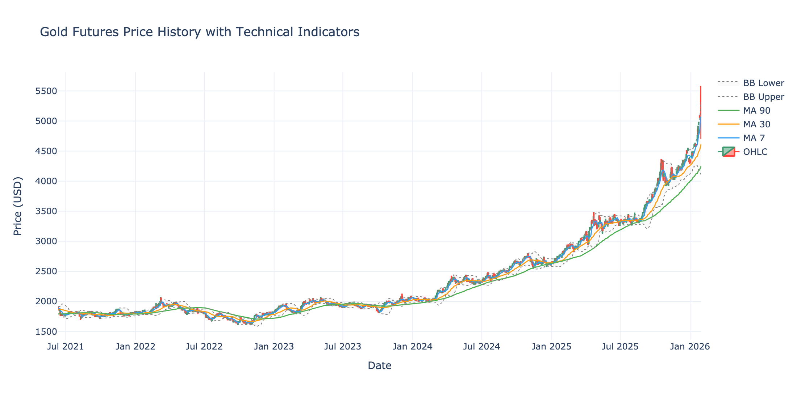
*Candlestick chart showing the full price history with 7-day (blue), 30-day (orange), and 90-day (green) moving averages, plus Bollinger Bands (gray dotted). Gold rose from ~$1,800 in mid-2021 to over $5,000 by early 2026.*

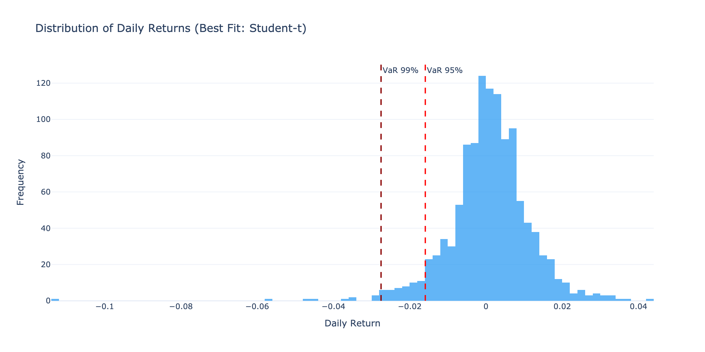
*Histogram of daily returns with VaR 95% and VaR 99% marked. Note the fat tails — extreme moves occur more frequently than a normal distribution would predict, which is why the Student-t distribution fits best.*

Key statistics displayed include:
- Mean daily return and annualized return
- Annualized volatility
- Skewness and excess kurtosis (both confirm non-normality)
- Historical VaR at 95% and 99% confidence
- T-test result for whether mean return differs from zero
- Ljung-Box test for volatility clustering

### Tab 2: Forecast

Shows ML model predictions and their reliability. This tab does not change with user inputs — it reflects the gold market's behavior regardless of who is asking.

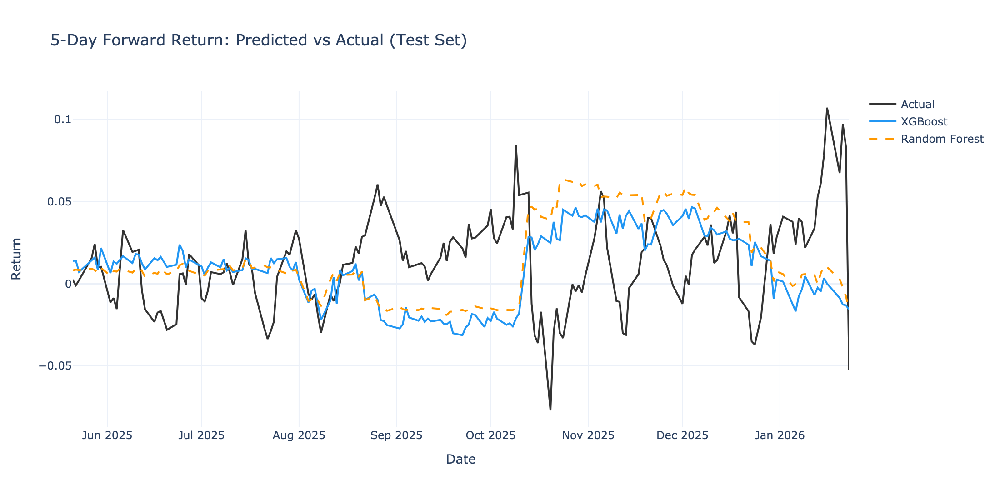
*5-day forward return predictions on the test set. The blue line (XGBoost) and orange dashed line (Random Forest) track against the actual returns (black). Both models capture the general direction but struggle with magnitude during high-volatility periods.*

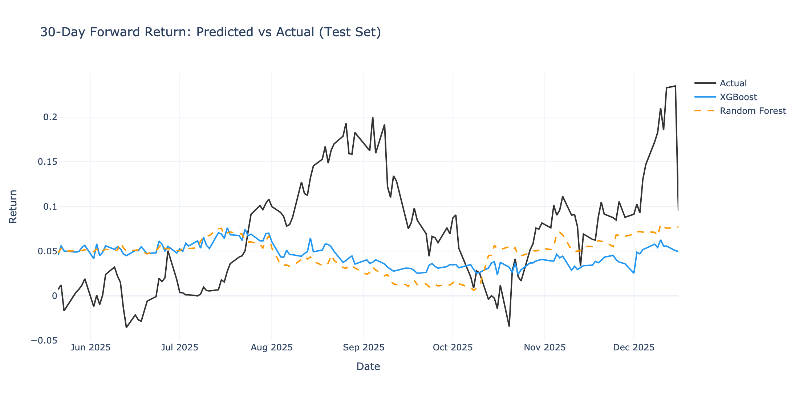
*30-day forward return predictions. Smoother than the 5-day horizon because the longer averaging period reduces noise.*

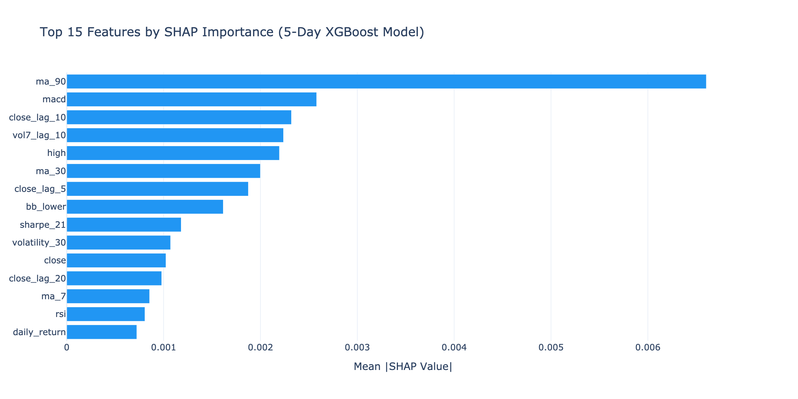
*Top 15 features by SHAP importance for the 5-day XGBoost model. This reveals which inputs the model relies on most heavily for its predictions.*

Performance metrics are displayed in a comparison table showing RMSE, MAE, and directional accuracy for each model at each horizon.

### Tab 3: Portfolio Optimization

This is where personalization begins. The efficient frontier and allocation recommendations change based on the user's risk tolerance, current portfolio, and constraints.

See [Example Cases](#7-example-cases) for how this tab looks under different profiles.

### Tab 4: Risk Simulation

Shows 10,000 Monte Carlo simulation paths for the optimized portfolio over the user's investment horizon. Key outputs: probability of loss, VaR, CVaR, and maximum drawdown distribution.

See [Example Cases](#7-example-cases) for how simulation results differ dramatically across profiles.

### Tab 5: Decision Analysis

The decision matrix, four criteria results, strategy comparison chart, and rebalancing economics. This tab produces the formal recommendation.

### Tab 6: Recommendation

A one-page executive summary with the recommended allocation, key metrics, and a disclaimer.

### Tab 7: Methodology

Course mapping table and design decision explanations. Intended for the professor/evaluator.

---

## 7. Example Cases

### Case 1: Conservative Retiree

**Profile:** $500,000 capital, currently 5% gold / 40% equity / 55% cash, Conservative risk tolerance, 365-day horizon.

**This represents:** Someone near or in retirement who prioritizes capital preservation but wants to know if their portfolio is too conservative.

#### Efficient Frontier

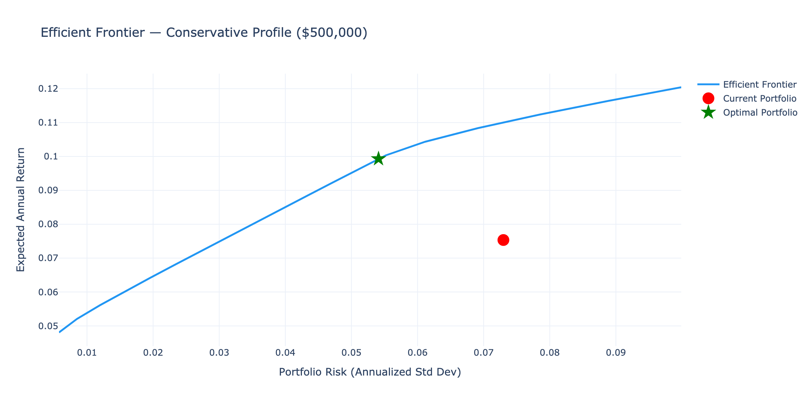
*The red dot (current portfolio) sits well below and to the right of the efficient frontier. This means the investor is taking on more risk than necessary for their level of return — the 55% cash allocation is too heavy. The green star shows the optimal portfolio on the frontier, which achieves a higher return at lower risk.*

#### Allocation Change

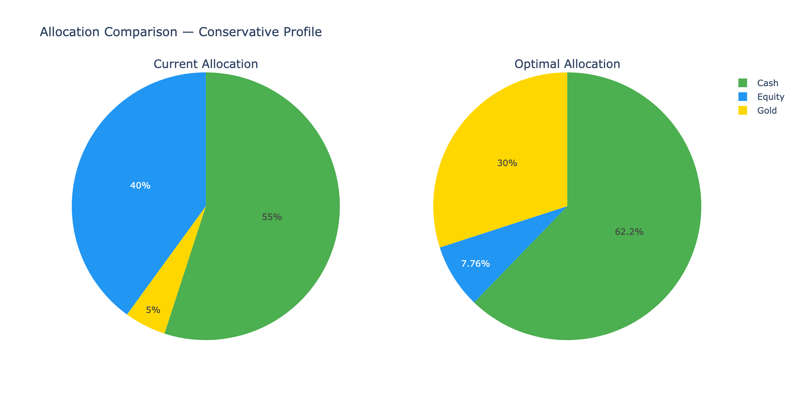
*The optimizer recommends increasing gold from 5% to the maximum allowed under Conservative constraints (30%), reducing equity, and reducing cash to the minimum (20%). Even within conservative bounds, there's significant room for improvement.*

#### Monte Carlo Simulation

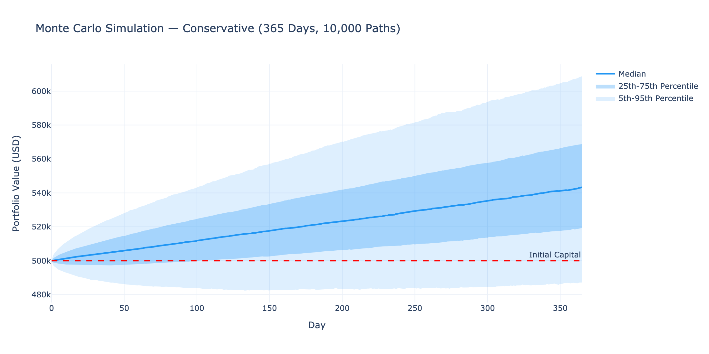
*365-day simulation for the optimized conservative portfolio. The fan chart is relatively narrow. The median outcome reaches approximately $540,000 (8% return). Even the 5th percentile stays near or above initial capital. This is a low-risk, positive-expected-value outcome.*

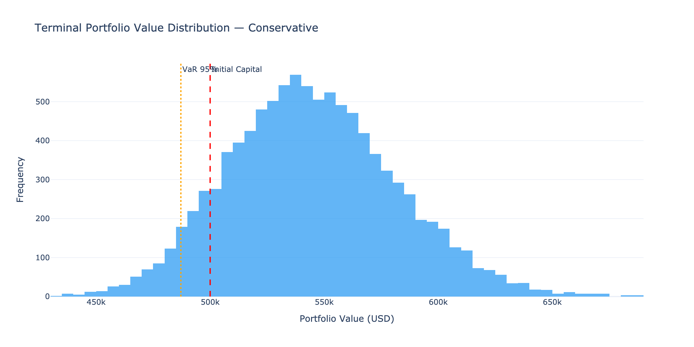
*Terminal value distribution. The bulk of outcomes fall between $490,000 and $590,000. VaR 95% is modest — the worst 5% of scenarios still don't result in catastrophic loss.*

#### Decision Analysis

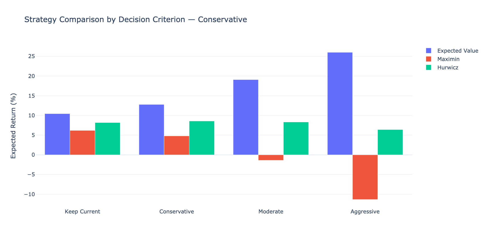
*Strategy comparison across decision criteria. Notice the differences: Expected Value and Hurwicz both favor a higher-gold allocation, while Maximin may favor the more conservative approach. The sensitivity analysis reveals whether the recommendation is robust or depends on which criterion you trust.*

---

### Case 2: Moderate Investor

**Profile:** $100,000 capital, currently 10% gold / 60% equity / 30% cash, Moderate risk tolerance, 180-day horizon.

**This represents:** A mid-career professional with a balanced portfolio looking to optimize their allocation over a 6-month period.

#### Efficient Frontier

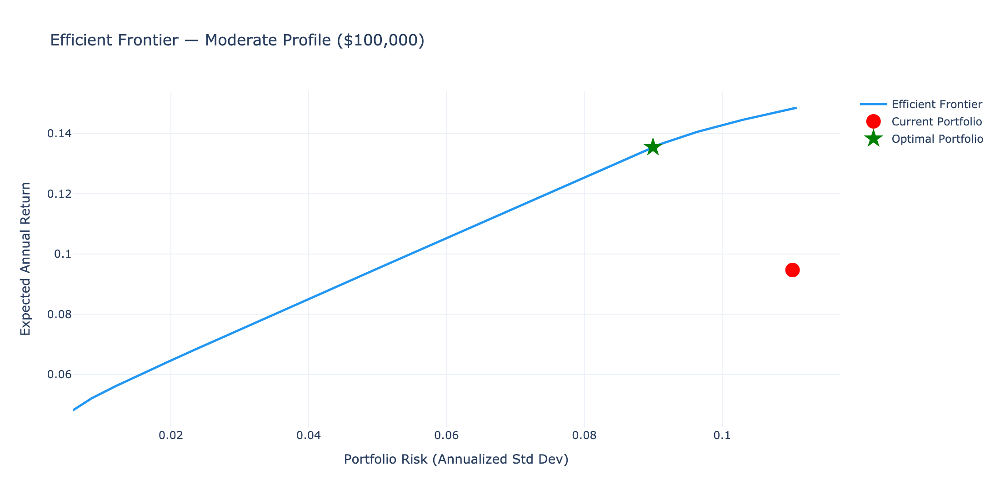
*The red dot (current portfolio at 10/60/30) is clearly below the frontier. The optimizer finds a portfolio (green star) that achieves ~13% expected return at ~8% risk — a significant improvement in Sharpe ratio. The key insight: the current 60% equity allocation introduces more risk than necessary.*

#### Allocation Change

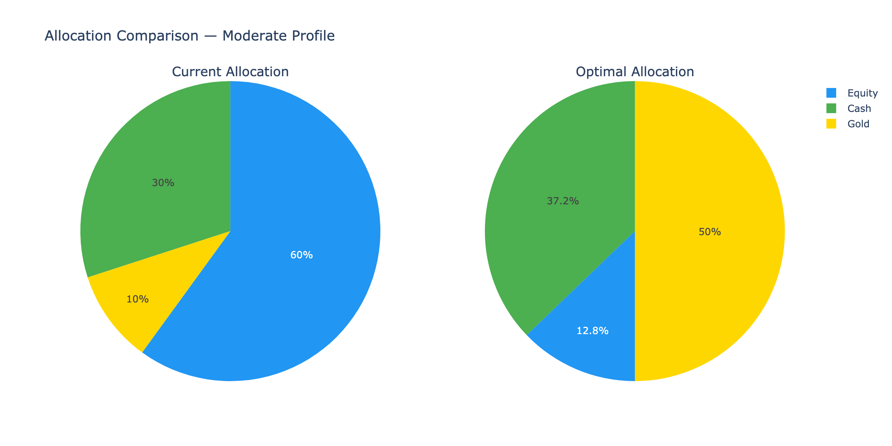
*The optimizer recommends a substantial shift — increasing gold to near its 50% maximum and adjusting equity and cash accordingly. This leverages gold's strong risk-adjusted return and low correlation with equities.*

#### Monte Carlo Simulation

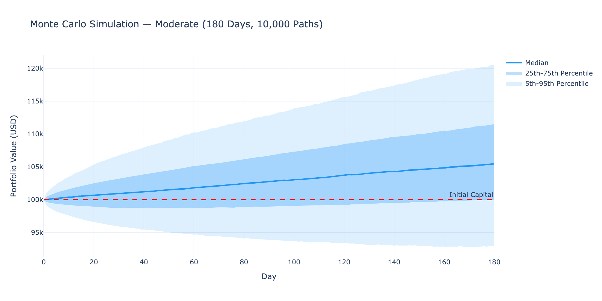
*180-day simulation. Wider bands than the conservative case. The median outcome is solidly positive, but the 5th percentile dips noticeably below initial capital — this is the tradeoff for higher expected returns.*

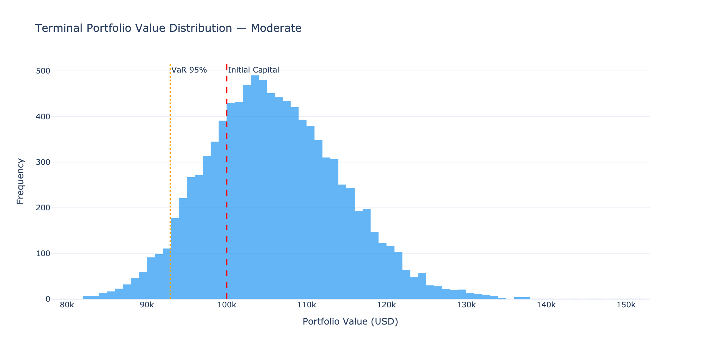
*Terminal value distribution shows a wider spread than the conservative case. More upside potential, but also a meaningful left tail.*

#### Decision Analysis

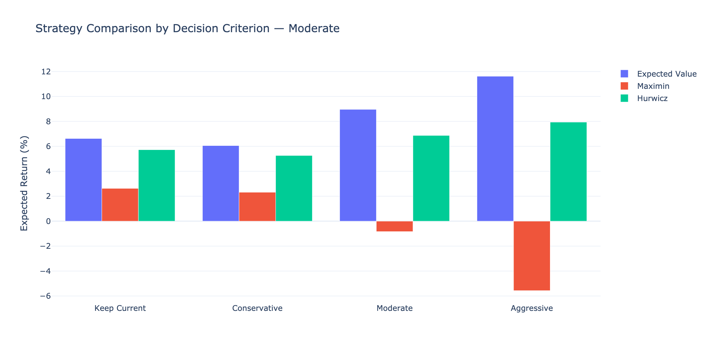
*The criteria may disagree more here than in the conservative case. Expected Value likely favors a higher-gold strategy, while Maximin may prefer keeping more cash. This disagreement is the tool working as designed — it surfaces the tension between maximizing returns and protecting against downside.*

---

### Case 3: Aggressive Young Professional

**Profile:** $25,000 capital, currently 20% gold / 75% equity / 5% cash, Aggressive risk tolerance, 90-day horizon.

**This represents:** A young investor with high risk tolerance, small capital, and a short time horizon. Can afford to take risks because they have decades to recover from losses.

#### Efficient Frontier

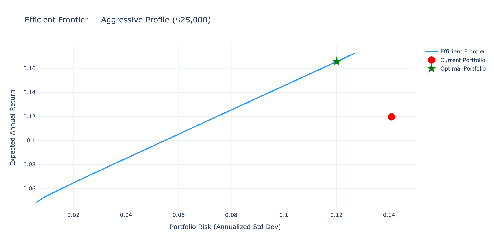
*With aggressive constraints (up to 70% gold, only 5% minimum cash), the optimizer explores a wider region of the frontier. The current portfolio may already be reasonably positioned since it's already equity-heavy.*

#### Allocation Change

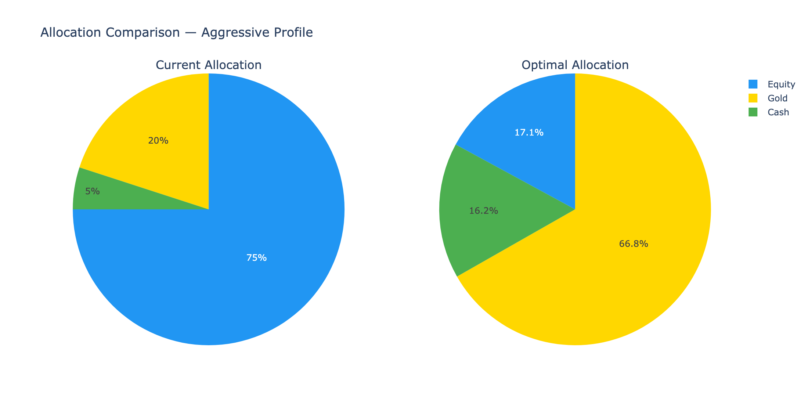
*The optimizer likely pushes gold allocation significantly higher — potentially to 50-70%. With aggressive constraints allowing minimal cash, the portfolio is fully invested in return-generating assets.*

#### Monte Carlo Simulation

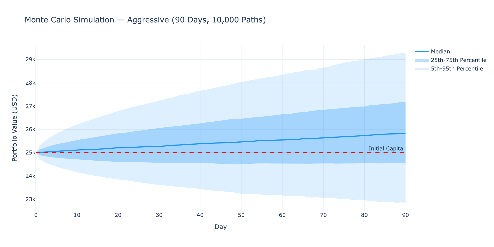
*90-day simulation. Shorter horizon means less time for returns to compound, but also less time for disasters to unfold. The fan chart is proportionally wide relative to the time horizon, reflecting the aggressive allocation's volatility.*

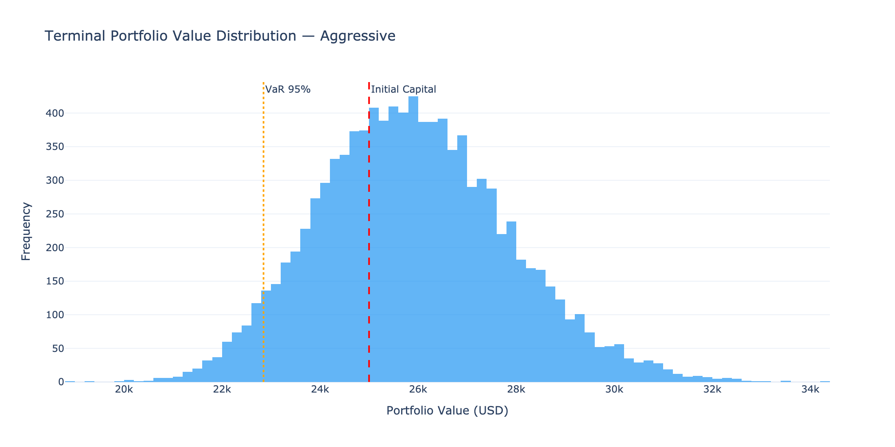
*Terminal value distribution for the aggressive portfolio. Note the wider spread compared to the conservative case — more scenarios both above and below initial capital. The probability of loss is higher, but so is the expected upside.*

#### Decision Analysis

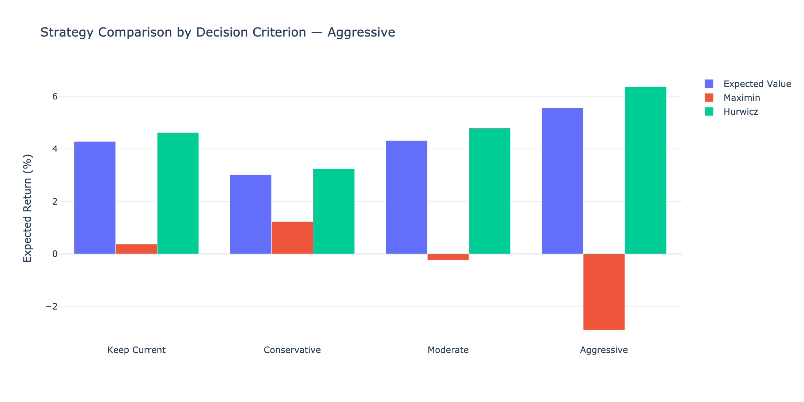
*With Hurwicz alpha = 0.7 (weighted toward optimism), the Hurwicz criterion aligns with Expected Value in favoring the most aggressive strategy. Maximin diverges, favoring downside protection. For a young investor who can stomach short-term losses, Expected Value is typically the right criterion.*

---

### Comparing Across Cases

| Metric | Conservative | Moderate | Aggressive |
|--------|-------------|----------|------------|
| Capital | $500,000 | $100,000 | $25,000 |
| Horizon | 365 days | 180 days | 90 days |
| Current Gold % | 5% | 10% | 20% |
| Optimal Gold % | ~30% | ~50% | ~50-70% |
| Fan Chart Width | Narrow | Medium | Wide |
| Probability of Loss | Low (~10-15%) | Moderate (~20-25%) | Higher (~25-35%) |
| Criteria Agreement | Mostly agree | Some disagreement | More disagreement |

**Key takeaway:** The tool adapts its recommendations to each investor's situation. A conservative retiree with $500K gets a very different recommendation than an aggressive young professional with $25K — as it should.

---

## 8. Course Mapping

Each module directly applies techniques from a specific MGTE course:

| Course | Module | Techniques Applied |
|--------|--------|-------------------|
| **MSCI 251/253** — Probability & Statistics | `risk_analysis.py` | Distribution fitting (Normal, Student-t, Skew-Normal) with KS and Anderson-Darling tests. One-sample t-test for mean return. Ljung-Box test for volatility clustering. Historical and parametric VaR/CVaR. Skewness and kurtosis analysis. |
| **MSCI 261/263** — Engineering Economics | `economics.py` | NPV of the rebalancing decision discounted at risk-free rate. Break-even analysis (days until incremental return exceeds transaction costs). Opportunity cost computation. Transaction cost modeling. |
| **MSCI 331/332** — Optimization | `portfolio_optimizer.py` | Markowitz mean-variance optimization as a constrained quadratic program. SLSQP solver via scipy. Equality constraints (weights sum to 1), inequality constraints (min cash), bound constraints (max gold). Efficient frontier computation (50-point sweep). |
| **MSCI 333** — Simulation | `simulation.py` | Regime-switching Geometric Brownian Motion with estimated transition probabilities. 10,000-path Monte Carlo. Output distributions: terminal wealth, maximum drawdown. VaR and CVaR from simulation. Probability of loss estimation. |
| **MSCI 436** — Decision Support Systems | `app.py` | Interactive Streamlit dashboard with personalized user inputs. Real-time output updates. Multiple linked views (tabs) for different analytical perspectives. Cached computation for responsiveness. |
| **MSCI 446** — Machine Learning | `forecasting.py` | XGBoost and Random Forest regressors. Walk-forward validation (expanding window). GARCH(1,1) for volatility forecasting. SHAP explainability. Metrics: RMSE, MAE, directional accuracy. Deliberate choice of tree models over deep learning given dataset size. |
| **MSCI 452** — Decision Under Uncertainty | `decision_engine.py` | Decision matrix (strategies x scenarios). Four formal criteria: Expected Value, Maximin, Minimax Regret (Savage), Hurwicz. Scenario probability estimation from regime analysis. Sensitivity analysis across criteria. |

---

## 9. Setup and Installation

### Prerequisites
- Python 3.9 or higher
- pip package manager

### Installation

```bash
# Clone or download the project
cd Gold-Futures-Project

# Install dependencies
pip install -r requirements.txt

# Run the dashboard
streamlit run app.py
```

The dashboard will open at `http://localhost:8501`.

**First load:** Takes approximately 30 seconds due to ML model training (walk-forward validation). Subsequent interactions are fast because model results are cached.

### Dependencies

```
streamlit>=1.30.0        # Dashboard framework
pandas>=2.0.0            # Data manipulation
numpy>=1.24.0            # Numerical computing
scipy>=1.11.0            # Optimization (SLSQP solver)
scikit-learn>=1.3.0      # Random Forest, preprocessing
xgboost>=2.0.0           # XGBoost regressor
shap>=0.43.0             # Model explainability
plotly>=5.18.0           # Interactive visualizations
statsmodels>=0.14.0      # ARIMA, statistical tests
pmdarima>=2.0.0          # Auto ARIMA order selection
arch>=6.0.0              # GARCH volatility models
pydantic>=2.0.0          # Input validation
```

No TensorFlow, PyTorch, or Keras. This is an intentional design choice — see [Design Decisions](#10-design-decisions).

---

## 10. Design Decisions

### Why XGBoost over LSTM?

The dataset contains 1,167 rows. LSTMs (and deep learning in general) require large datasets to learn meaningful patterns — typically thousands to tens of thousands of samples. With 1,167 rows split into train/val/test, the training set has ~816 samples. An LSTM would overfit severely or learn nothing useful.

XGBoost handles small tabular datasets with engineered features effectively. Choosing the right model for the data size demonstrates stronger ML judgment than defaulting to the most complex architecture.

### Why Streamlit over Dash?

Streamlit requires less boilerplate than Dash (no callback management, no explicit layout objects). For a single-page dashboard with interactive inputs and cached computations, Streamlit's programming model is more natural. The `@st.cache_resource` decorator handles expensive computation caching with zero additional code.

### Why regime-switching GBM over plain GBM?

Gold markets exhibit distinct bull and bear regimes with different return and volatility characteristics. A single-distribution GBM would average these regimes together, underestimating both the upside in bull markets and the downside in bear markets. The regime-switching model captures this bimodality, producing more realistic simulation outputs.

### Why four decision criteria instead of one?

Different investors have different decision-making philosophies. Some care most about expected value (the "rational" approach), some are extremely loss-averse (Maximin), some worry about regret (Minimax Regret), and some want a weighted blend (Hurwicz). Showing all four and where they agree/disagree gives the user genuine insight into the robustness of the recommendation. If all four criteria agree, the recommendation is strong. If they disagree, the user learns something important about the risk-return tradeoff they're facing.

### Why not include real equity data?

The dataset only covers gold futures. Including real S&P 500 data would require an additional data source, time-alignment, and would complicate the analysis without fundamentally changing the methodology. Using well-established benchmark parameters (10% annual return, 18% volatility for equities; 4.5% for cash) is standard practice in portfolio optimization when the focus is on one asset class. This is clearly documented as a simplifying assumption.

### Why Plotly over Matplotlib?

Plotly produces interactive charts (hover, zoom, pan) that work natively in Streamlit. For a decision support dashboard where users need to explore data, interactivity matters. Matplotlib produces static images that would require additional work to make interactive in a web context.
